# Hi, I'm Joyce!🙌
Chiayin Yang  
Industrial Designer x UX Designer  
Welcome to this new GitHub repository!

# Weekly Reports: table of contents
[week 1: 0829-0905](https://github.com/Berkeley-MDes/tdf-fa24-joyce-mdes/tree/main?tab=readme-ov-file#week-1-0829-0905)  
[week 2: 0906-0912](https://github.com/Berkeley-MDes/tdf-fa24-joyce-mdes/tree/main?tab=readme-ov-file#week-2-0906-0912)  
[week 3: 0913-0919](https://github.com/Berkeley-MDes/tdf-fa24-joyce-mdes/tree/main?tab=readme-ov-file#week-3-0913-0919)  
[week 4: 0920-0926](https://github.com/Berkeley-MDes/tdf-fa24-joyce-mdes/tree/main#week-4-0920-0926)  
[week 5: 0927-1003](https://github.com/Berkeley-MDes/tdf-fa24-joyce-mdes/tree/main?tab=readme-ov-file#week-5-0927-1003)   
[week 6: 1004-1010](https://github.com/Berkeley-MDes/tdf-fa24-joyce-mdes/tree/main?tab=readme-ov-file#week-6-1004-1010)  
[week 7: 1011-1017](https://github.com/Berkeley-MDes/tdf-fa24-joyce-mdes/tree/main?tab=readme-ov-file#week-7-1011-1017)   
[week 8: 1018-1024](https://github.com/Berkeley-MDes/tdf-fa24-joyce-mdes/tree/main?tab=readme-ov-file#week-8-1018-1024)  
[week 9: 1025-1031](https://github.com/Berkeley-MDes/tdf-fa24-joyce-mdes/tree/main?tab=readme-ov-file#week-9-1025-1031)   
[week 10: 1101-1107](https://github.com/Berkeley-MDes/tdf-fa24-joyce-mdes/tree/main?tab=readme-ov-file#week-10-1101-1107)  
[week 11: 1108-1114](https://github.com/Berkeley-MDes/tdf-fa24-joyce-mdes/tree/main?tab=readme-ov-file#week-11-1108-1114)  
[week 12: 1115-1121](https://github.com/Berkeley-MDes/tdf-fa24-joyce-mdes/tree/main?tab=readme-ov-file#week-12-1115-1121)  
[week 13: 1122-1128](https://github.com/Berkeley-MDes/tdf-fa24-joyce-mdes/tree/main?tab=readme-ov-file#week-13-1122-1128)   
[week 14: 1129-1205](https://github.com/Berkeley-MDes/tdf-fa24-joyce-mdes/tree/main?tab=readme-ov-file#week-13-1122-1128)

---

# Week 1: 0829-0905 #

### Portrait exercise in the Studio Foundation class
Drawing portraits of classmates is a really fun activity! It’s a great way to quickly break the ice and get to know each other better through art (plus, you get to observe them closely—haha!).  

The image below shows a portrait of me drawn by a classmate. **What a wonderful drawing!**

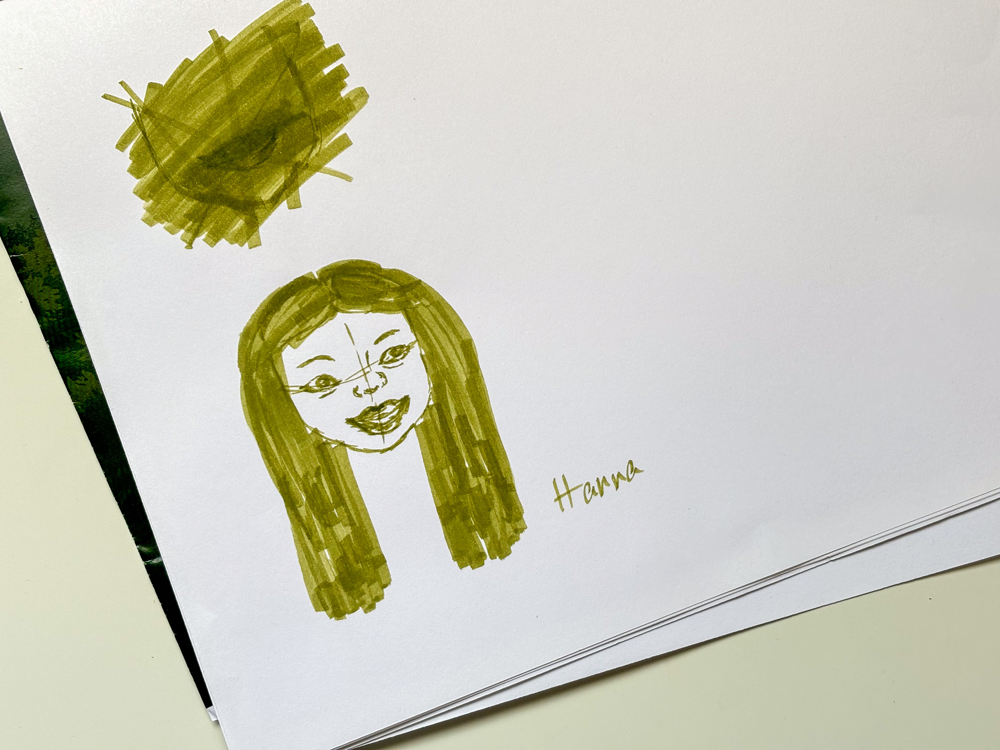 

### Drawing Toast in the Design Framework class
During the activity, I noticed that each person had a different understanding of the requirements. Making toast may seem simple, but everyone had their own method—one person even drew 22 steps to make toast! Despite this, all of our sketches included steps and arrows, just as highlighted in the video. **Sorting out the process is the first step to understanding the whole of a complex problem.** After reorganizing, we ended up with a simplified process that clearly highlighted the underlying issues.

[TED talk: Got a wicked problem? First, tell me how you make toast](https://www.ted.com/talks/tom_wujec_got_a_wicked_problem_first_tell_me_how_you_make_toast?subtitle=en)

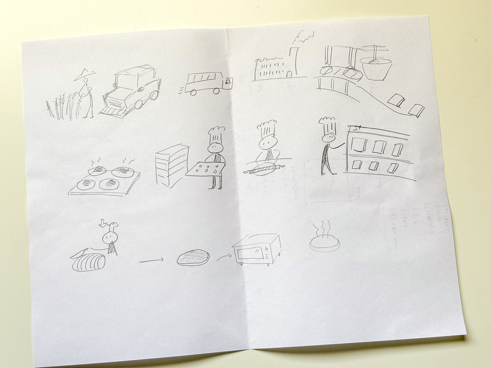

### Laser-cutting exercise for the Technology Design Foundations class
This week, I completed the Jacobs **online laser cutter training**. Although I had used a laser cutter frequently before, I still had trouble getting familiar with the new system.  

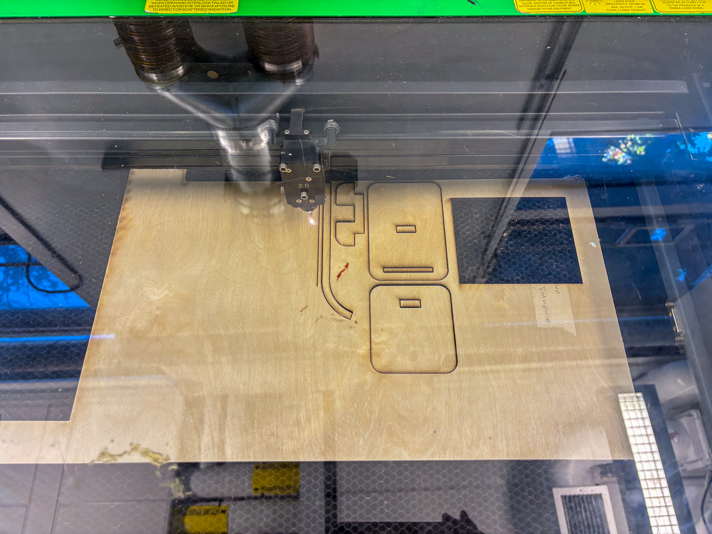

For this assignment, I designed a phone stand. However, since I didn't have the exact thickness of the wood boards, my design failed during assembly. As you can see, there is a part that didn’t fit into the holes. Next time, I will measure the thickness of the material before doing the design.

Regarding the design process, I initially aimed for a rotating support for the phone stand, which required several attempts to test different structures using Rhino. I also researched various laser-cutting products online to gather ideas about the structure. Despite multiple failures, I concluded that testing the design with actual materials would be most effective. Consequently, I created the first version, laser-cut it, and used this prototype to explore different structures for the rotating support.

 **#Speculations**   
We now need an **environment equipped with a variety of tools and materials** (like the Makerspace) to design numerous products or mechanisms. In the future, if we have a product (whether physical or digital) that allows us to **develop ideas within a virtual 3D environment** and includes simulated materials, we would be able to iterate quickly and create designs that are practical and usable.

[Back to table of contents](https://github.com/Berkeley-MDes/tdf-fa24-joyce-mdes/tree/main?tab=readme-ov-file#weekly-reports-table-of-contents)  

---

# Week 2: 0906-0912 #

This week, I visited **BLICK Art Material** to explore tools and interesting materials that can be used in the following classes. 

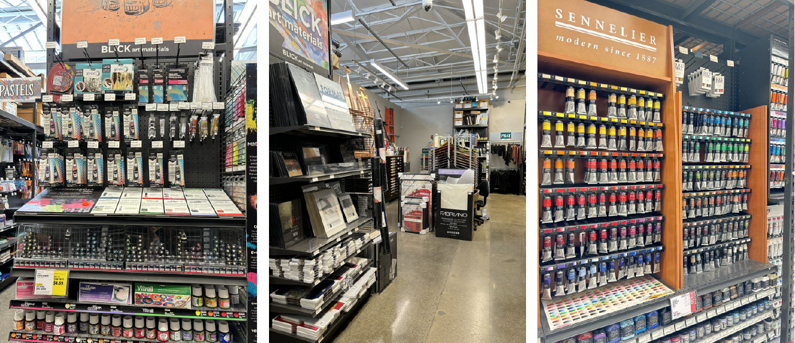

I explored several Rhino grasshopper tutorials this week. I learned how to build 3D models through diagrams and the logic of connection between each block.

This model is a bottle.

This is an exercise about creating lines between three curves automatically.

This picture shows that I adjusted the parameters from the file.  

And then, in the Monday class, I joined the group teaching how to use Prusa mk3s+ 3D printers.

 **#Speculations**   

During this process, I wondered why it was necessary to use additional software to adjust settings before printing with a 3D printer. I imagined that, after exporting the STL file, we could directly upload it to the 3D printer, which would automatically adjust each parameter to ensure a successful print.

Additionally, if a 3D projector were integrated into the 3D printer, it could allow us to preview the product's size directly on the build plate.

[Back to table of contents](https://github.com/Berkeley-MDes/tdf-fa24-joyce-mdes/tree/main?tab=readme-ov-file#weekly-reports-table-of-contents)  

---

# Week 3: 0913-0919 #

### Keep working on Project 1

For my Project 1 assignment, I decided to design an iPad stand. 

I began by researching ideas on Pinterest, then measured the dimensions and sketched a design for the stand. 

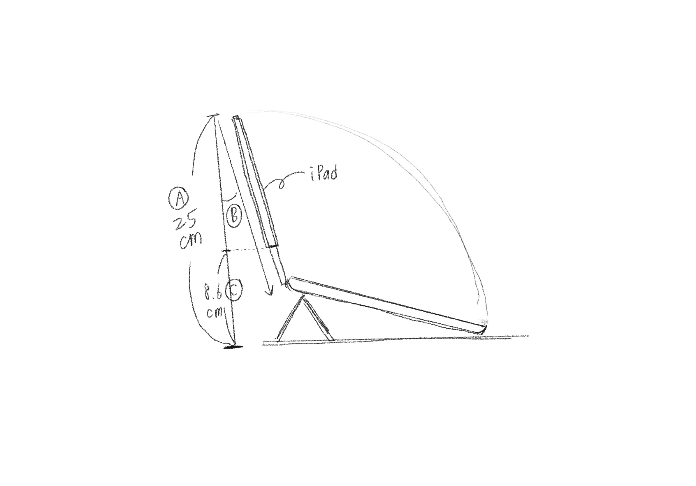

I started creating a new 3D model using Grasshopper. I began by designing two surfaces for the top and bottom of the stand, then connected them to form a solid object.

Next, I created an iPad and subtract it.

I then used a solid object to subtract the section that would obstruct the iPad screen.

Finally, I exported the model as a STEP file and imported it into Solidworks to make slight adjustments to its appearance. If I had more time, I would learn how to use Rhino and Grasshopper to refine the design.

 **#Reflections**   

To learn Grasshopper, I spent a lot of time learning the basic commands. However, I felt that I should also randomly explore the interface to see how much I could accomplish without any prior experience.

 **#Speculations**    

While creating the 3D model, I kept thinking about how great it would be to control the design with sentences. For example, 'I want to create a 30cm x 20cm box, then subtract a 10cm x 5cm box from the front.' This would eliminate the need to learn the software, reducing the learning curve.

[Back to table of contents](https://github.com/Berkeley-MDes/tdf-fa24-joyce-mdes/tree/main?tab=readme-ov-file#weekly-reports-table-of-contents)  

---

# Week 4: 0920-0926 #

This weekend, I spent approximately a whole afternoon completing the Project 1 Report.  
It was quite interesting to see feedback from other classmates.
The feedback was super helpful and I was inspired. 
While doing the report, several ideas for improvement came to my mind, so I wrote them in the report.

I did this assignment with a classmate, and we discussed what content should be included in the report.   
we also watched the videos in the Project 1 playlist together.

[a link to all of the AMAZING Project 1 Videos](https://www.youtube.com/playlist?list=PLLpvMj60-6aElXXOIYAc9WgsSKhzly2VR)  

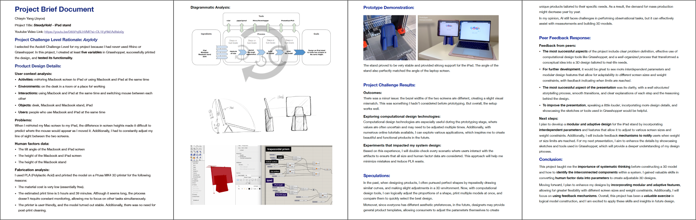

After the TDF Monday class, I started to pay attention to personal devices in my daily life. Then, I created an ecosystem map for personal devices.  

To be honest, before doing this assignment, I never thought about how these devices connect, or what technology is involved. The connections between these devices are unconscious for me.  

  

 **#Reflections**   

After doing this assignment, I realized that I should learn how connections work between personal devices. Then, I can speculate what kind of devices should be connected to enhance the convenience of daily life.

 **#Speculations**   

In our daily lives, there are always some tasks that we perform every day, such as opening the curtains, turning on the lights, and starting the diffuser. If we could preset the on and off times for these devices, we would save a lot of time managing them. I look forward to having this kind of lifestyle in the near future.

[Back to table of contents](https://github.com/Berkeley-MDes/tdf-fa24-joyce-mdes/tree/main?tab=readme-ov-file#weekly-reports-table-of-contents)  

---

# Week 5: 0927-1003 #

### S08 2024/09/26 w05 Th ###

For this assignment, we needed to modify the pin configuration in the code. As a result, I was able to compile and flash the program successfully and efficiently.

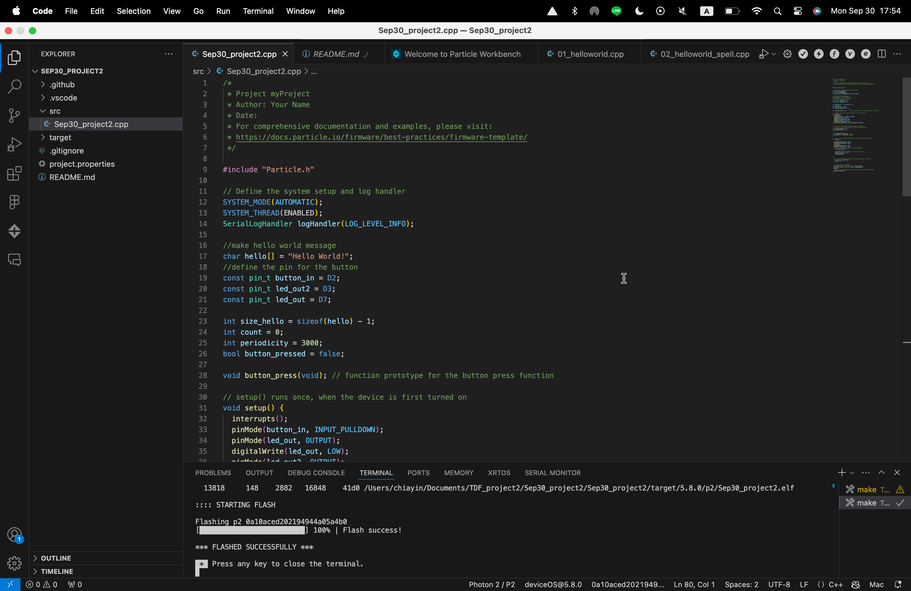

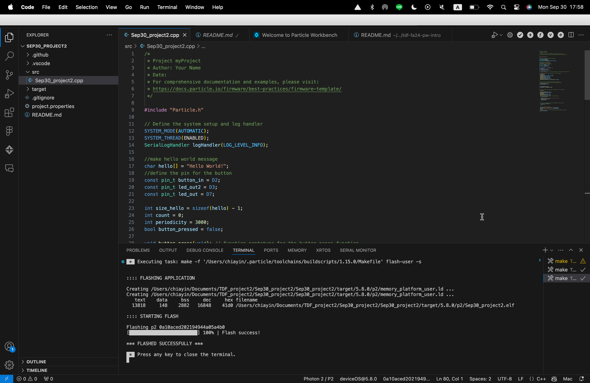

### S09 2024/09/30 w06 M ###

For this assignment, I chose these three tutorials: 
1. fsr (force sensitive resistor) -> RGB-led color fader
2. Button Send on change
3. fsr (force sensitive resistor) -> RGB-led color fader

**➔ fsr (force sensitive resistor) -> RGB-led color fader**

I failed to compile this file initially, so I checked each connection and followed the steps carefully. 

After adjusting some connections, I recompiled it. This time, the error was reduced.

I didn't know what to do, so I asked ChatGPT.
It told me to add two lines of code.

`void setColor(int R, int G, int B);  `  
`void setTarget(int red, int green, int blue);`

Then, I compiled successfully!

But I failed to flash. 😿  

Then, I found that it was due to the wrong particle platform. 
I fixed it so it was FLASHED SUCCESSFULLY!

[demo video](https://drive.google.com/drive/folders/1aik8pKlGb3Zc-qyxPNk-CxOpG3VctEj5?usp=sharing)  

**➔  LED pulse rate**

This time, I adjust few codes and it worked!

[demo video](https://drive.google.com/drive/folders/1aik8pKlGb3Zc-qyxPNk-CxOpG3VctEj5?usp=sharing)  

**➔ Button Send on change**

This exercise is quite easy for me.

 **#Reflections**   

One of the key challenges I faced was ensuring the correct configuration of the hardware and code, particularly when it came to handling interrupts and managing timing. Initially, I encountered an issue where the interrupt function wasn’t recognized in the code, which forced me to dive deeper into how the scope of function declarations works in embedded systems. By addressing this, I strengthened my understanding of the importance of code structure and organization. I now feel more confident in my ability to troubleshoot and adapt to unexpected challenges in future projects.

 **#Speculations**   

While the current program is tailored to a specific hardware setup (LED and button), there is potential for scaling this to larger systems. The program could be adapted to control more complex output devices, such as motors or servos, and respond to multiple input triggers, expanding its functionality for broader applications in interactive devices or IoT solutions.

Although the current system functions well for its intended purpose, exploring dynamic inputs, debouncing mechanisms, and non-blocking operations could greatly improve performance, robustness, and user experience.

[Back to table of contents](https://github.com/Berkeley-MDes/tdf-fa24-joyce-mdes/tree/main?tab=readme-ov-file#weekly-reports-table-of-contents) 

---

# Week 6: 1004-1010 #

### S10 2024/10/03 w06 Th ###

I tried for more than 2 hours on Saturday morning and I'm still stuck at this stage (as shown in the picture).

I flashed successfully during the TDF class on Monday because a classmate helped me with that. The tutorial on the Slack channel is helpful as well!!

  
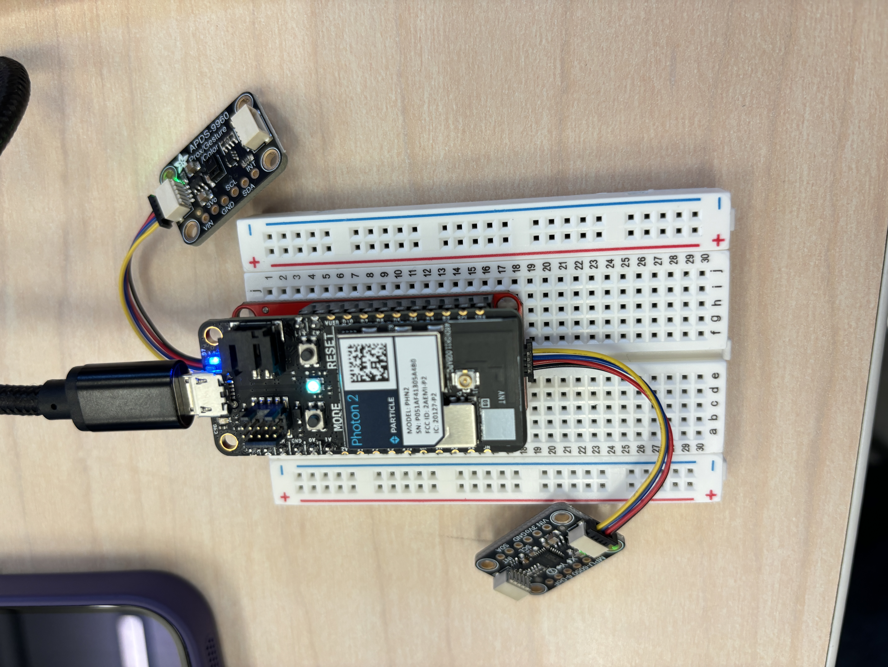   

I formed a group in Monday's class. This was our original ideation about our project.

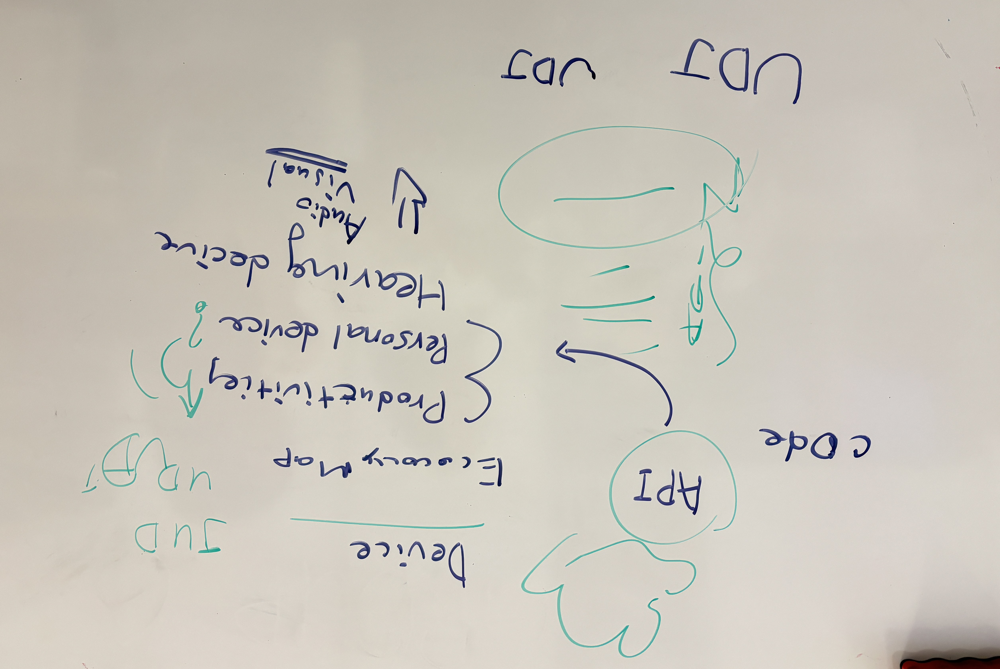

Based on that, we rethink the topic, and we would like to focus on pulse rate detection.

After doing research, we created this diagram as our "Draft System Architecture".

Process Diagram

 **#Reflections**   

This week was particularly challenging due to the volume of assignments, especially with the added pressure of building a proposal for Project 2 with a newly formed team. I had just learned how to compile a Photon 2 code file and was still unsure how to apply this tool in a practical context. Despite that, we had only three days to put together a complete proposal. I realize the proposal might not be perfect and is likely to undergo significant changes in the coming days, which left me feeling frustrated.

 **#Speculations**  

I’m excited about the idea we’re developing for our proposal. If we can successfully combine pulse rate monitoring with productivity, it could have potential applications in both the health and tech industries. By making pulse rate visible, we could adjust our work and break times based on our individual physiological needs. It would be amazing to see this idea come to life!

[Back to table of contents](https://github.com/Berkeley-MDes/tdf-fa24-joyce-mdes/tree/main?tab=readme-ov-file#weekly-reports-table-of-contents) 

---

# Week 7: 1011-1017 #

In Thursday's class, we received some feedback on our proposal, with the key takeaway being the importance of making the system more practical and reasonable.

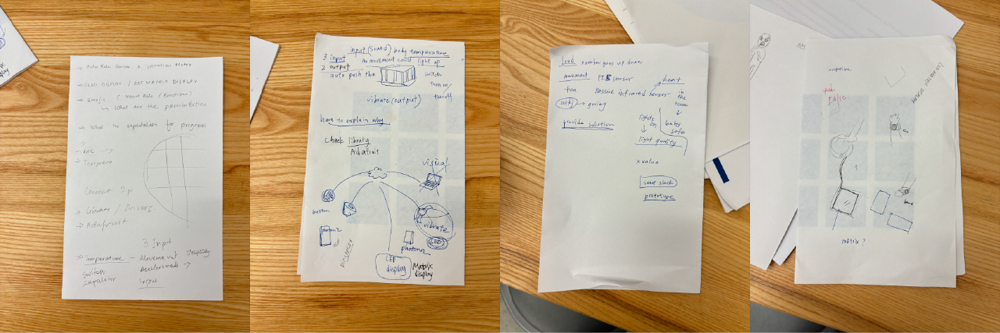

This is the second version of our proposal, as we initially weren't aware that the project required using three inputs and two outputs. We added a loudness sensor and a motion sensor as inputs for our project.

We have developed our first version of the code, which ensures that the system functions properly. It is gratifying to see data consistently appearing in the Serial Monitor.

The next step was to publish data to the console, and as shown in the picture below, we successfully retrieved data from Photon 2.

Next, we attempted to subscribe to the data from the console and transfer it to the second Photon 2.

However, we encountered a situation in which we were uncertain about the cause of the error in our code.

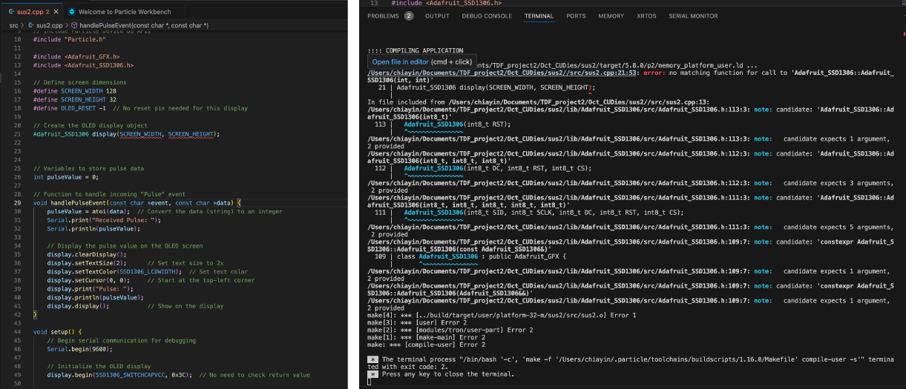

 **#Reflections**  

Reflecting on my recent experiences, I recognize the challenges I faced in the programming world due to my limited knowledge of coding. While I successfully developed the first version of our code and ensured the system functioned properly, I encountered difficulties in understanding certain errors that arose. This situation highlighted the importance of foundational knowledge in coding, which would enable me to better comprehend what is happening within the code. As I saw data consistently appearing in the Serial Monitor, I felt a sense of accomplishment, but I also realized that gaining a deeper understanding of coding fundamentals would significantly enhance my confidence and ability to troubleshoot issues effectively in the future.

 **#Speculations**  

I hope that in the future, we will have programming systems that can automatically debug code without requiring manual intervention. Such systems could employ machine learning techniques to recognize common coding pitfalls and offer real-time suggestions or modifications. This would not only save significant time and reduce frustration for developers but also allow individuals with limited coding knowledge to engage more confidently with programming. 

[Back to table of contents](https://github.com/Berkeley-MDes/tdf-fa24-joyce-mdes/tree/main?tab=readme-ov-file#weekly-reports-table-of-contents) 

---

# Week 8: 1018-1024 #

Over the weekend, we worked with the Google API to display three pieces of data.

After working for an hour and a half, we resolved the display issue.

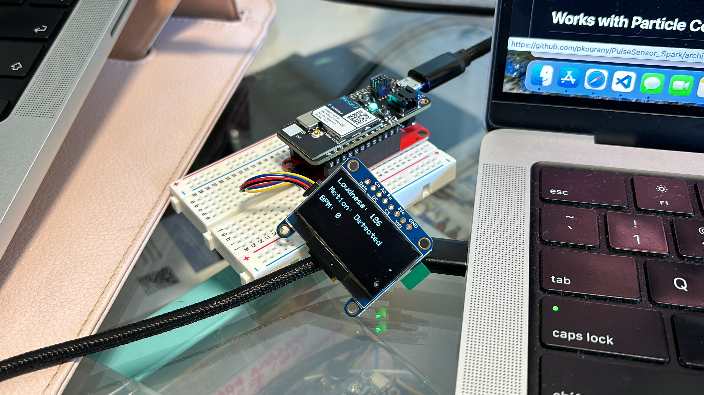

Then, we adjusted the code to enable the motion sensor to activate the vibration.

After seeking help from Ankur, a student from Cohort 4, we finally obtained the accurate BPM to display people's heart rates.

In the meantime, I created a 3D model of a wearable device designed for parents. Here is my sketch.

I used Fusion 360 to create the 3D models.

the final outcome:

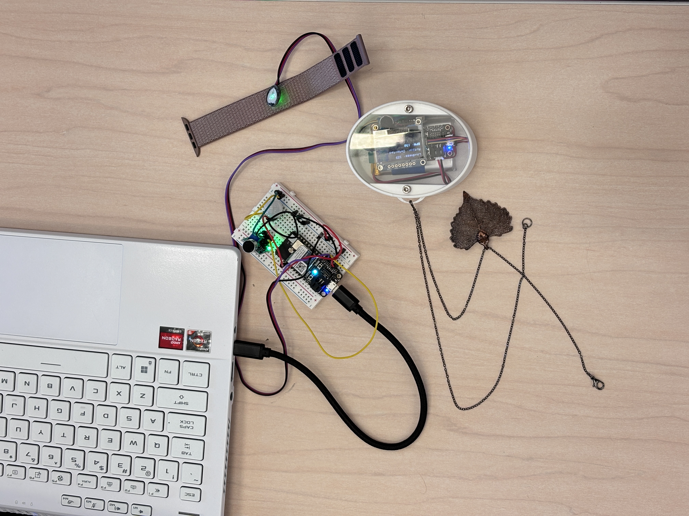

Quick Links for this project:
- [proposal](https://docs.google.com/document/d/1KkkGOEXoQYGXXcZ097M4WQxfQmqmNXLVHORN__TeHjY/edit#heading=h.ans2vcsg6svj)
- [code documentation](https://docs.google.com/document/d/1BAV2Vq1qa3Z2Ugzx5df0acKqu8BxbbpIgyMFDGo5TNc/edit?tab=t.0)
- [video plan](https://docs.google.com/document/d/1BAV2Vq1qa3Z2Ugzx5df0acKqu8BxbbpIgyMFDGo5TNc/edit?tab=t.0#heading=h.wsqqxmsroitt)
- [YouTube link](https://www.youtube.com/watch?v=dK12RXg2iB8)
- [Figjam file](https://www.figma.com/board/fBudlrlz36H1bidGu9ZaSE/TDF-Team-CUDies?node-id=84-182&t=fkZRmkWHGblZ9Ts8-1)
- [slide file](https://www.figma.com/slides/hTbe2s4EI5IbB8AxrE0fAS/slides-for-TDF-video?node-id=1-844&t=8BzvXLbSVb5ofdRS-1)
- [final code files (receive side)](https://drive.google.com/file/d/1yEGMj-GoANcb_CthJY53qojlAnaefLXj/view?usp=sharing)

 **#Reflections**  

For this project, we faced challenges due to our limited knowledge of coding and microcontroller hardware. At one point, no matter what we tried, the code wouldn’t run. However, after restarting both our laptops and the Photon2, it finally worked. I learned that when we encounter a problem, it's helpful to reach out to someone with more experience in the field, as they might find a solution quickly and save us a lot of time.

Although ChatGPT was very helpful with the coding for our project, given our lack of a computer science background, I still felt we spent a lot of time on it. Since I didn’t fully understand what each line of code meant, I couldn’t modify it myself. It was a significant challenge for me to align the code's outcomes with my expectations.

 **#Speculations**  

Given the variety of microcontrollers available today, standardizing their specifications could greatly enhance usability. If these devices could be designed to stack easily and maintain a consistent appearance, it would simplify the recording process and make them more approachable for users. A uniform design and clear visual guidance would significantly reduce barriers for beginners, making it easier for them to understand and work with microcontrollers without feeling overwhelmed by the chaos of differing formats.

[Back to table of contents](https://github.com/Berkeley-MDes/tdf-fa24-joyce-mdes/tree/main?tab=readme-ov-file#weekly-reports-table-of-contents) 

---

# Week 9: 1025-1031 #

This week, I learned how to use LLMs through ZeroWidth.

### Exploreing some examples provided by TJ

### Following the tutorial taught by Peter Binggeser

ZeroWidth platform intro: ZeroWidth is a platform that aims to transform the design of Al from being a technical task to a collaborative one.

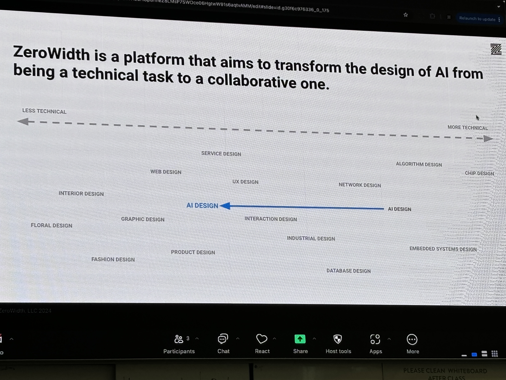

Started a new project

Opened demo page

Added a knowledge file

### Following the tutorial taught by TJ learned how to build your own LLM experiments

- [tutorial link](https://share.descript.com/view/tJeu2pzTO4N)
- Dem, Oh GPT Experiment 01 [demo interface](https://zerowidth.ai/c/demo/DVioPyQh916BJHnEOgQh/draft)
- Dem, Oh GPT+INSTRUCT Experiment 01 [demo interface](https://zerowidth.ai/c/demo/xrrGgoNrysuRlEY9nPeS/draft)
- Dem, Oh GPT+INSTRUCT+RAG Experiment 01 [demo interface](https://zerowidth.ai/c/demo/gNq7Jy33H2sh5QQ4B8xS/draft)
- Dem, Oh GPT+INSTRUCT+RAG+VARIABLE Experiment 01 [demo interface](https://zerowidth.ai/c/demo/LdJLpnPCNAk1YAz76b1c/draft)

Dem, Oh GPT Experiment 01

Dem, Oh GPT+INSTRUCT Experiment 01

Dem, Oh GPT+INSTRUCT+RAG Experiment 01

Dem, Oh GPT+INSTRUCT+RAG+VARIABLE Experiment 01

 **#Reflections**  

The first time I saw the examples provided by TJ, I felt frustrated. I didn’t have any background in LLM, and I doubted my ability to create a project like the ones TJ showed us. At that point, I struggled to understand what semantic embedding is and how LLMs work. However, after following the tutorial step by step, I started to grasp how to use it and apply it because Zerowidth has an easy-to-understand interface. This experience taught me not to underestimate my abilities at first glance. Instead, I should give myself the chance to explore and learn.

 **#Speculations**  

I believe Zerowidth has extensive applications, as it easily connects inputs with an LLM to generate content through the output module. Beyond personal assistant functions, it could be used as a storyteller or a chatbot in various spaces to provide visitors with helpful information, such as restroom directions in a museum or map guidance in a library.

[Back to table of contents](https://github.com/Berkeley-MDes/tdf-fa24-joyce-mdes/tree/main?tab=readme-ov-file#weekly-reports-table-of-contents) 

---

# Week 10: 1101-1107 #

### Final prototype agent

This week, I explored the knowledge base. I tried to use different types of data as the knowledge base.

In addition to exploring the final prototype agent, I also spent a lot of time this week working on creating videos.

 **#Reflections**  

I initially didn't have many thoughts about this tool, but after seeing my classmates' results, I feel that they have come up with some great ideas on how to use Zerowidth. It also sparked some interesting ideas in my own mind, and I hope I can actually bring them to life.

 **#Speculations**  

With the tool "Zerowidth," the application of LLMs will become extremely widespread. In the past, only those with extensive background knowledge could effectively use and apply LLMs. However, with this tool, it becomes much easier to turn an LLM into a personal productivity tool, even for simulating many innovative ideas.

[Back to table of contents](https://github.com/Berkeley-MDes/tdf-fa24-joyce-mdes/tree/main?tab=readme-ov-file#weekly-reports-table-of-contents) 

---

# Week 11: 1108-1114 #

### Project 3 Report

This week, I’ve been working on the report, and I forgot to take a screenshot of the response from the fourth and final agent, so I lost the original answer. I then re-entered the questions, took a screenshot of the new response, and uploaded it into my report. I hope this doesn’t cause any confusion.

I inputted 5 assigned questions and 3 additional questions to test the 5 agents, and I believe their responses were logical because I could identify some patterns between them. When the agents didn’t have a knowledge base related to my project, the first and second agents wouldn’t answer questions about my project. The third agent, however, would use experience from other projects to answer the questions, though sometimes the responses were quite odd. The fourth and final agent, having access to a relevant knowledge base, was able to answer the questions based on my specific project experience.

Finally, I finished the report, and it’s 25 pages long. It’s crazy!

 **#Reflections**  

Although there is a very detailed document explaining the requirements for the assignment, it still took me some time to understand exactly what I should include in my report. I’m also grateful to my classmates for asking questions about the assignment requirements in Slack, as I had the same confusion. Additionally, when I was almost done with the assignment, I saw the requirements on bCourse and ended up spending an extra two hours making my work better align with those expectations. Next time, I hope to confirm the requirements earlier to ensure I fully understand both the PDF document outlining the assignment and the bCourse requirements. I’m also thankful that the deadline for this report was extended to Thursday, as it gave me more time to refine my work.

 **#Speculations**  

When testing the agents, I felt that this technology has infinite possibilities. If I could get more examples of its applications, I think it would help expand my imagination. I believe this tool could help me remember all the knowledge I’ve learned in life. I would just need to input the content I’ve learned in class into the knowledge base, and then I could have an infinitely large repository to quickly review my recent learning through a simple question-and-answer process.

[Back to table of contents](https://github.com/Berkeley-MDes/tdf-fa24-joyce-mdes/tree/main?tab=readme-ov-file#weekly-reports-table-of-contents) 

---

# Week 12: 1115-1121 #

### Final project proposal
My team name is R2J.
This project focuses on the intersection of in-car interaction design, automotive technology, and Internet of Things (IoT) to enhance the passenger experience during road trips. A key feature is integrating karaoke functionality, offering dynamic lyric displays and enabling interactive controls such as hand gesture detection for switching songs or adjusting volume. The system can also utilize two paired devices, one for the driver and one for rear-seat passengers, ensuring an inclusive and engaging experience for everyone in the car.

I used mid-journey to generate an image but it didn't meet my expectation. 

Then, I sketched to communicate with my team members.

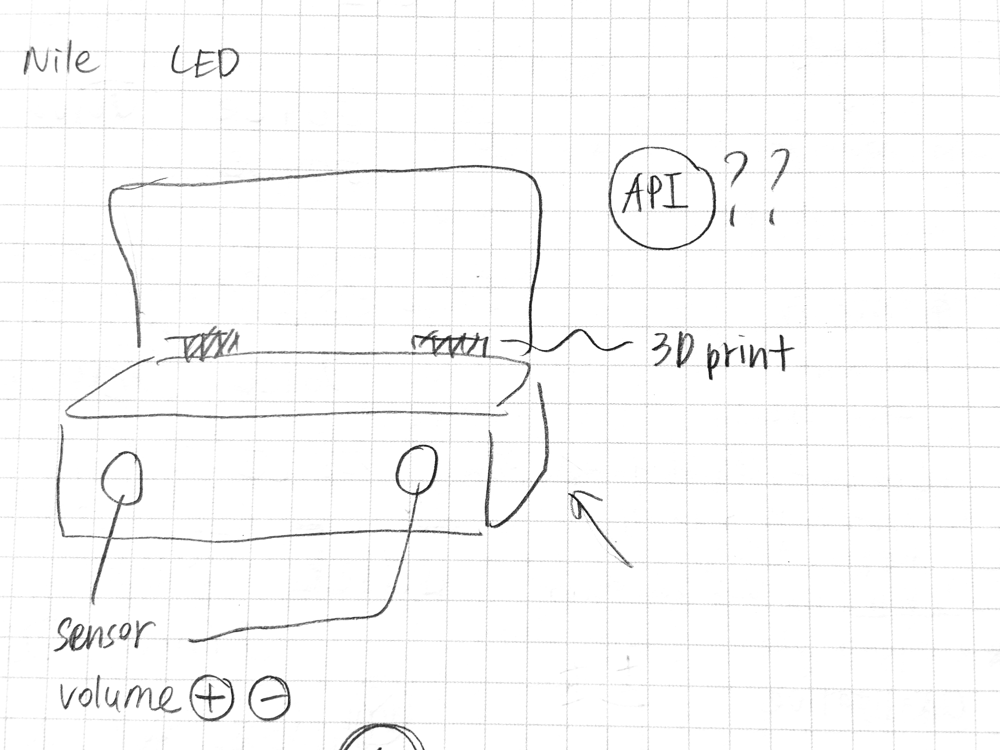  

and then, I created this system to get the full picture of our project.

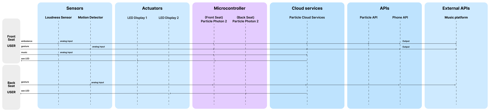

 **#Reflections**  

This week, I’ve been thinking about how to consolidate everything I’ve learned this semester, but I’ve found it quite challenging. The main reason is my insufficient understanding of technical concepts. For example, I always thought LLMs could work with microcontrollers, but I’ve heard that’s not the case.  

Additionally, the modeling techniques I learned in other courses aren’t actually very useful. They don’t help people who are unfamiliar with 3D software learn how to use it, nor do they teach skills for creating models without relying on 3D modeling software.  

I believe that to enable collaboration among people from such diverse fields, the most important thing is to help everyone understand each other’s limitations. Only then can we effectively divide tasks and work together.

 **#Speculations**  

Building on this topic, how can we effectively convey our abilities in the shortest possible time? Some skills are binary—either you have them or you don’t—while others range from “basic understanding” to “expert-level proficiency.” Aligning team members’ understanding of each other’s skills is crucial. If there were a tool to achieve this in the future, it would be incredibly helpful.  

The closest option we have now might be LinkedIn, but it’s clearly insufficient. For people from unrelated fields, it’s difficult to immediately grasp the nature of a skill through “words” or “tags.” It doesn’t provide a clear picture of what the ability actually entails.  

This makes me wonder if there’s a better way to visually or interactively communicate skill levels and capabilities across disciplines. What do you think?

[Back to table of contents](https://github.com/Berkeley-MDes/tdf-fa24-joyce-mdes/tree/main?tab=readme-ov-file#weekly-reports-table-of-contents) 

---

# Week 13: 1122-1128 #

### Final project

 **#Reflections**  

 **#Speculations**  

[Back to table of contents](https://github.com/Berkeley-MDes/tdf-fa24-joyce-mdes/tree/main?tab=readme-ov-file#weekly-reports-table-of-contents) 

---

# Week 14: 1129-1205 #

### Final project

 **#Reflections**  

 **#Speculations**  

[Back to table of contents](https://github.com/Berkeley-MDes/tdf-fa24-joyce-mdes/tree/main?tab=readme-ov-file#weekly-reports-table-of-contents) 

---

## Quick Links, compiled here for your convenience: ##

- [TDF Wiki](https://github.com/Berkeley-MDes/24f-desinv-202/wiki) - the ultimate source for truth and information about the course and assignments
- [Google Drive Folder](https://drive.google.com/drive/u/0/folders/1DJ1b6sSDwHXX6NRcQYt10ivyQSgU0ND6) - slides and other resources
- [bCourses](https://bcourses.berkeley.edu/courses/1537533) - where the grading happens
