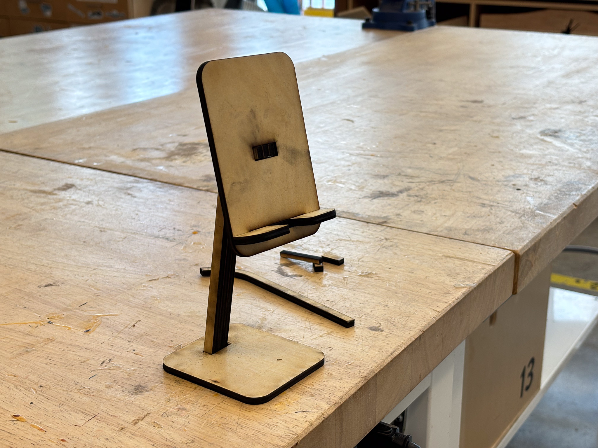

# Hi, I'm Joyce!🙌
Industrial Designer x UX Designer x Project Management

Welcome to this new GitHub repository! Please feel free to leave comments!

# Outline
[week 1](README.md#week-1-example-report-1)

week 2, etc...

---

# Week 1: #
## Week of 09/05/2024

This week, I designed a phone stand. Initially, I hope it's head can 

Reflections
in complete sentences or paragraphs, and perhaps images or videos.
reflections on what you learned and how you learned it
an assessment of the state of your work
Speculations
in complete sentences or paragraphs, and perhaps images or videos.
speculation on future direction for the tools [so much is changing very quickly right now, where do you think this is going? Why do you think this?]
speculation on future direction for the work
bonus: thoughtful descriptions of something interesting and relevant you heard about in the news or industry publications. include text, an image, a link, and a reference that you can follow up on later and share with your peers.
Images & Video
images & video should be unified with your presentation (not just a folder of images)
images & video should be directly relevant to the project (What does each shot show us?)
Sketches, Drawings, and Diagrams
this could include flowcharts, design files, whiteboarding, storyboards, etc
pencil & paper sketches, drawings, post-its, etc (photographed or scanned and uploaded)

---

## Quick Links, compiled here for your convenience: ##

- [TDF Wiki](https://github.com/Berkeley-MDes/24f-desinv-202/wiki) - the ultimate source for truth and information about the course and assignments
- [Google Drive Folder](https://drive.google.com/drive/u/0/folders/1DJ1b6sSDwHXX6NRcQYt10ivyQSgU0ND6) - slides and other resources
- [bCourses](https://bcourses.berkeley.edu/courses/1537533) - where the grading happens
